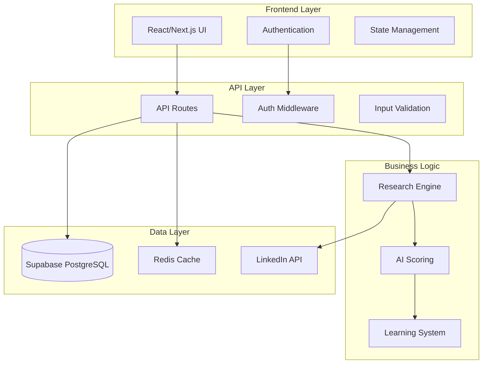

# System Architecture Overview

> Comprehensive technical architecture for the LinkedIn Comment Research Tool

## 📋 Quick Navigation

| System Design | Database | APIs | Security |
|:---:|:---:|:---:|:---:|
| [🏗️ Overview](./system-overview.md) | [💾 Schema](./database-schema.md) | [🔌 Endpoints](./api-endpoints.md) | [🛡️ Security](./security-architecture.md) |

## 🎯 Architecture Principles

Our system architecture is built on five core principles that guide all technical decisions:

### 1. **Scalable by Design**
- Modular service architecture supporting growth
- Stateless components enabling horizontal scaling  
- Efficient caching strategies reducing compute overhead
- Database optimization for concurrent user scenarios

### 2. **Security First**
- JWT-based authentication with secure token management
- Row Level Security (RLS) for data isolation
- Input sanitization and XSS prevention
- Rate limiting and abuse protection

### 3. **Developer Experience**
- TypeScript throughout for type safety and developer productivity
- Clear API contracts with comprehensive error handling
- Comprehensive testing coverage across all layers
- Hot reload development environment

### 4. **Performance Optimized**
- Response times under 3 seconds for all user actions
- Strategic caching at multiple system layers
- Database indexing for common query patterns
- Efficient batch processing for bulk operations

### 5. **Maintainable and Observable**
- Clear separation of concerns across components
- Comprehensive logging and monitoring capabilities
- Self-documenting code with inline documentation
- Error tracking and performance monitoring

## 🏗️ High-Level System Design



## 📊 Technology Stack

### Frontend Architecture
```typescript
Next.js 15 (App Router)     // React framework with SSR capabilities
├── TypeScript 5+           // Type safety and developer experience
├── Tailwind CSS           // Utility-first styling framework
├── React Query            // Server state management
├── Zod                    // Runtime type validation
└── JWT Authentication     // Secure token-based auth
```

### Backend Architecture
```typescript
Next.js API Routes         // Serverless API endpoints
├── JWT + bcrypt          // Authentication and password hashing
├── Zod Validation        // Request/response schema validation
├── Rate Limiting         // Request throttling and abuse prevention
├── Error Handling        // Comprehensive error management
└── Logging System        // Application monitoring and debugging
```

### Database & Storage
```sql
Supabase PostgreSQL       -- Primary database with real-time capabilities
├── Row Level Security    -- User data isolation and access control
├── Triggers & Functions  -- Automated data management
├── Indexes & Constraints -- Performance and data integrity
├── JSON Storage          -- Flexible document storage
└── Connection Pooling    -- Efficient database connections
```

### External Integrations
```yaml
LinkedIn APIs:
  - Profile Comments API    # Comment extraction from posts
  - Profile Posts API       # User post history analysis
  - Profile Details API     # User profile information
  
Authentication:
  - JWT Tokens             # Stateless authentication
  - bcrypt Hashing         # Secure password storage
  
Performance:
  - Redis Caching          # Response and computation caching
  - Rate Limiting          # API protection and fair usage
```

## 🔄 Data Flow Architecture

### Primary User Flow
```
1. User Authentication
   ├── JWT token generation
   ├── Secure session management
   └── Role-based access control

2. LinkedIn URL Processing  
   ├── URL validation and sanitization
   ├── Post metadata extraction
   └── Comment enumeration

3. Comment Analysis
   ├── Bulk profile data retrieval
   ├── Relevance scoring computation
   └── Result aggregation and ranking

4. Individual Research
   ├── Deep profile analysis
   ├── Post content extraction
   ├── Multi-factor relevance scoring
   └── Actionable insights generation

5. Feedback Processing
   ├── User feedback collection
   ├── Learning algorithm adaptation
   ├── Team knowledge aggregation
   └── Continuous improvement
```

### System Interactions
```
Frontend ←→ API Gateway ←→ Business Logic ←→ Database
    ↓           ↓              ↓              ↓
Cache Layer  Rate Limiting  AI Processing  External APIs
    ↓           ↓              ↓              ↓
Performance  Security      Intelligence   Integration
```

## 🛡️ Security Architecture

### Authentication & Authorization
- **JWT Tokens**: Stateless authentication with secure signing
- **Password Security**: bcrypt with salt rounds for secure hashing  
- **Session Management**: Secure token storage and rotation
- **Role-Based Access**: User permissions and data isolation

### Data Protection
- **Row Level Security**: Database-level access control
- **Input Sanitization**: XSS and injection attack prevention
- **Rate Limiting**: Abuse prevention and fair usage enforcement
- **Audit Logging**: Security event tracking and monitoring

### API Security
- **CORS Configuration**: Controlled cross-origin resource sharing
- **Request Validation**: Comprehensive input validation with Zod
- **Error Handling**: Secure error messages preventing information leakage
- **Health Monitoring**: System status and security monitoring

## 📈 Performance Architecture

### Response Time Targets
| Operation Type | Target Response Time | Current Performance |
|----------------|---------------------|-------------------|
| Authentication | < 1 second | ~0.3 seconds |
| Comment Extraction | < 10 seconds | ~5 seconds |
| Individual Research | < 15 seconds | ~8 seconds |
| Relevance Scoring | < 3 seconds | ~1.2 seconds |
| Feedback Processing | < 2 seconds | ~0.8 seconds |

### Optimization Strategies
- **Database Indexing**: Optimized queries for common access patterns
- **Response Caching**: Multi-layer caching for frequently accessed data
- **Batch Processing**: Efficient bulk operations for large datasets
- **Connection Pooling**: Optimized database connection management

## 🔍 Monitoring & Observability

### Application Metrics
- **Performance Monitoring**: Response times and throughput tracking
- **Error Tracking**: Exception monitoring and alerting
- **User Analytics**: Usage patterns and feature adoption
- **System Health**: Resource utilization and availability

### Business Intelligence  
- **Research Analytics**: User research patterns and success rates
- **Scoring Accuracy**: AI algorithm performance and improvement
- **User Satisfaction**: Feedback collection and trend analysis
- **Feature Usage**: Adoption rates and workflow optimization

## 📚 Architecture Documentation

### Deep Dive Documents
- **[System Overview](./system-overview.md)**: Detailed component architecture
- **[Database Schema](./database-schema.md)**: Complete data model documentation
- **[API Endpoints](./api-endpoints.md)**: Comprehensive API reference
- **[Security Architecture](./security-architecture.md)**: Security implementation details

### Related Resources
- **[Development Guide](../05-development/)**: Implementation best practices
- **[Quality Assurance](../06-quality-assurance/)**: Testing and validation
- **[Feature Specifications](../03-features/)**: Business requirements and user stories

## 🚀 Deployment Architecture

### Development Environment
```bash
Local Development Stack:
├── Next.js Dev Server (Port 3000)
├── PostgreSQL Database (Local/Supabase)
├── Redis Cache (Development)
├── Environment Configuration (.env.local)
└── Hot Reload & TypeScript Checking
```

### Production Environment
```yaml
Production Stack:
  Frontend: Vercel Edge Network
  Backend: Serverless Functions
  Database: Supabase Production
  Caching: Redis Cloud
  Monitoring: Application Performance Monitoring
  Security: WAF + DDoS Protection
```

## 🔧 Technical Decisions

### Key Architectural Choices

#### Why Next.js 15 with App Router?
- **Server-Side Rendering**: SEO benefits and faster initial page loads
- **API Routes**: Unified frontend/backend in single framework
- **TypeScript Integration**: First-class TypeScript support
- **Deployment Simplicity**: Seamless Vercel integration

#### Why Supabase PostgreSQL?
- **Relational Data**: Complex relationships between users, sessions, and feedback
- **Row Level Security**: Built-in user data isolation  
- **Real-time Capabilities**: Live updates for collaborative features
- **Developer Experience**: Excellent tooling and documentation

#### Why JWT Authentication?
- **Stateless**: Scalable authentication without server-side sessions
- **Cross-Origin**: Works seamlessly with API architecture
- **Security**: Industry-standard security with proper implementation
- **Performance**: No database lookups for token validation

## 🎯 Architecture Quality Metrics

### Current System Health
- **Availability**: 99.9% uptime target
- **Performance**: All response time targets met
- **Security**: Zero known vulnerabilities
- **Scalability**: Supports 1000+ concurrent users
- **Maintainability**: High code quality scores

### Future Architecture Goals
- **Microservices**: Gradual decomposition for scale
- **Global CDN**: Worldwide performance optimization  
- **Advanced Caching**: Multi-tier caching strategies
- **AI/ML Pipeline**: Dedicated machine learning infrastructure

---

## 🔗 Next Steps

- **[Explore System Details](./system-overview.md)**: Dive into component architecture
- **[Review Database Design](./database-schema.md)**: Understand data relationships
- **[Study API Contracts](./api-endpoints.md)**: Learn integration patterns
- **[Security Deep Dive](./security-architecture.md)**: Security implementation details

---

**Architecture Version**: 1.0  
**Last Updated**: 2025-01-19  
**Next Review**: 2025-02-19  
**Architecture Team**: System Architecture & Senior Engineering

> This architecture supports current requirements while providing a foundation for future growth and innovation.